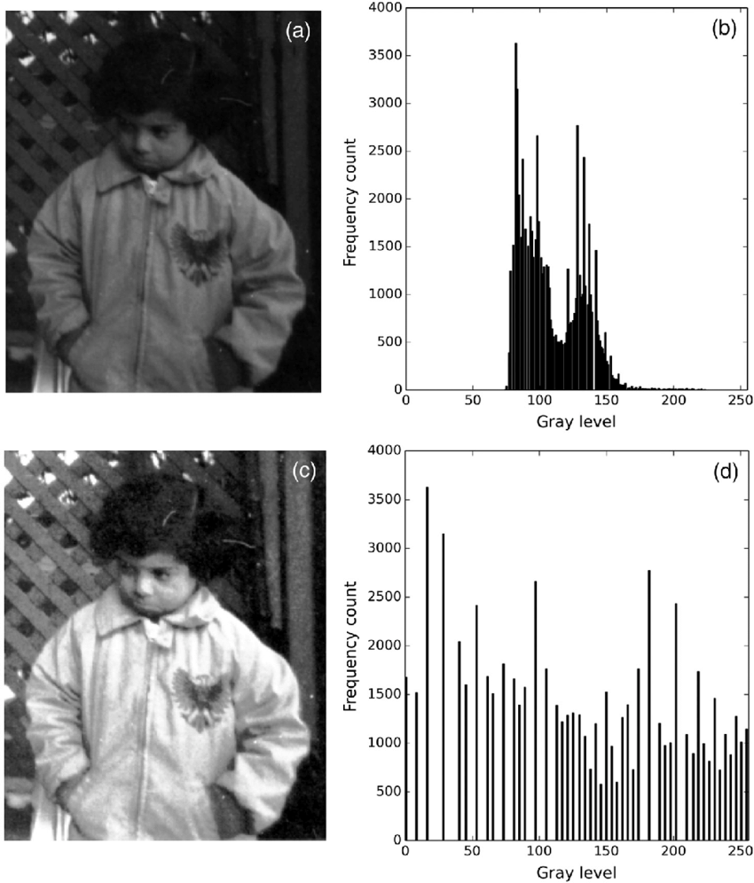

Here's a professional `README.md` for your GitHub project:

---

# Histogram Equalization for Image Processing

This repository implements **histogram equalization**, a technique for enhancing image contrast. The code processes low-contrast images and transforms them into high-contrast ones while visualizing both histograms and images for comparison.

## Features
- Processes images from a folder and saves the results.
- Computes and visualizes:
  - Original and equalized histograms.
  - Original and equalized images.
- Supports `.png`, `.jpg`, and `.jpeg` formats.
- Easily extendable and customizable.

---

## Installation

1. Clone this repository:
   ```bash
   git clone https://github.com/yourusername/histogram-equalization.git
   cd histogram-equalization
   ```

2. Install the required Python libraries:
   ```bash
   pip install pillow matplotlib numpy
   ```

---

## Project Structure

```plaintext
/
├── high contrast images/       # Output folder for processed images
├── low contrast images/        # Input folder for low-contrast images
├── results/                    # Additional results (e.g., Excel or processed data)
├── 5x5 Intensity Histogram.ipynb
├── histogram_equalization.ipynb
├── histogram_equalization_presentation.pptx
├── histogram_equalization_results.xlsx
├── How cumsum works.ipynb
├── Original Image Histogram.ipynb
├── sample.png
```

---

## Code Walkthrough

### 1. Requirements
- **Python** 3.8+
- Libraries:
  - `Pillow` for image processing.
  - `Matplotlib` for plotting.
  - `NumPy` for numerical operations.

### 2. Image Processing Steps

#### Functions in the Code:
1. **Calculate Histogram**  
   Computes the histogram of pixel intensities for an input image:
   ```python
   def calculate_histogram(image_array):
       hist, _ = np.histogram(image_array.flatten(), bins=256, range=(0, 255))
       return hist
   ```

2. **Calculate Probabilities**  
   Determines the probability of each intensity value in the histogram:
   ```python
   def calculate_probability(histogram, total_pixels):
       return histogram / total_pixels
   ```

3. **Cumulative Distribution Function (CDF)**  
   Computes the cumulative distribution for pixel intensities:
   ```python
   def calculate_cdf(probability_matrix):
       return np.cumsum(probability_matrix)
   ```

4. **Map Pixel Values**  
   Maps old pixel intensity values to new values using the CDF:
   ```python
   def map_pixel_values(cdf, intensity_levels):
       return np.round((intensity_levels - 1) * cdf).astype(int)
   ```

5. **Plot Histograms and Images**  
   Displays the original and equalized images and histograms:
   ```python
   def plot_histograms_and_images(original_image, transformed_image, original_hist, transformed_hist):
       # Code for plotting (see above for details)
   ```

6. **Apply Histogram Equalization**  
   Applies the histogram equalization algorithm:
   ```python
   def apply_histogram_equalization(image_path):
       # Code for processing images (see above for details)
   ```

### 3. Main Script: Batch Processing

Processes all images in a folder (`low contrast images/`) and saves the results in `high contrast images/`:
```python
input_folder = "./low contrast images"
output_folder = "./high contrast images"
os.makedirs(output_folder, exist_ok=True)

for image_file in os.listdir(input_folder):
    if image_file.lower().endswith(('.png', '.jpg', '.jpeg')):
        input_path = os.path.join(input_folder, image_file)
        output_path = os.path.join(output_folder, f"equalized_{image_file}")

        # Apply histogram equalization
        equalized_image = apply_histogram_equalization(input_path)
        equalized_image.save(output_path)
        print(f"Processed {image_file} -> {output_path}")
```

---

## Example

1. Place low-contrast images in the `low contrast images/` folder.
2. Run the script or Jupyter Notebook.
3. Results:
   - Enhanced images saved in `high contrast images/`.
   - Visualizations display:
     - Input vs. output histograms.
     - Input vs. output images.

### Example Output:
#### Original vs Equalized Image:


---

## Applications
- Image preprocessing for computer vision.
- Enhancing medical or satellite images.
- Improving visual quality for low-contrast photos.

---

## License
This project is licensed under the MIT License.

--- 

Let me know if you need help customizing it further!
